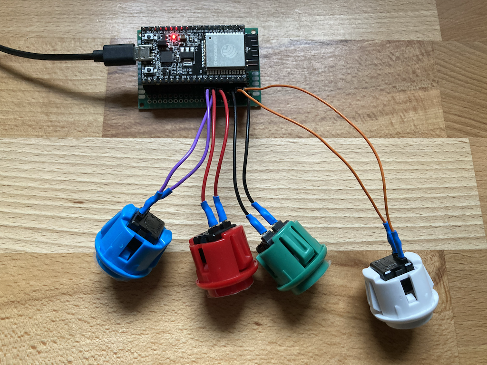
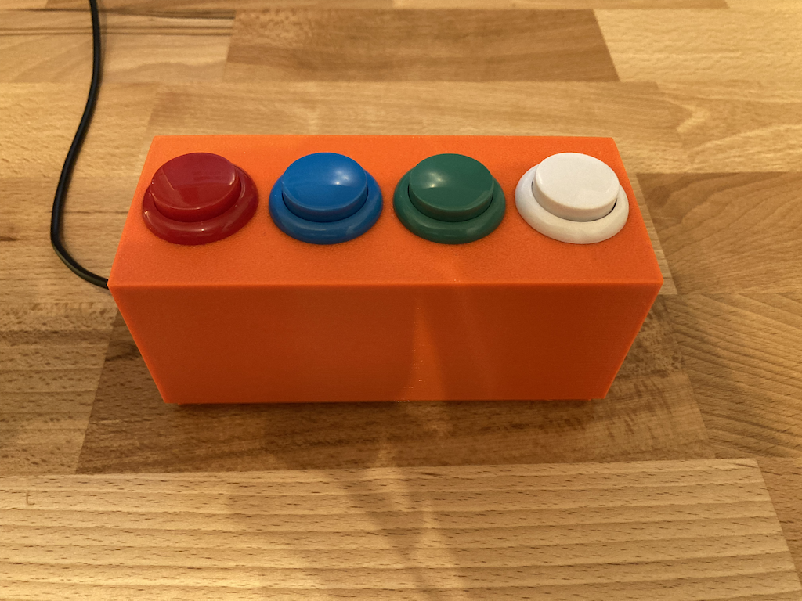

# MS Mute
A BLE Keyboard to control Microsoft Teams while you are on-call.

Buttons:
- white: play/pause music
- green: mute/unmute microphone
- blue: turn camera on/off
- red: leave meeting

## Bill of material
- [Arcade Buttons](https://www.amazon.de/dp/B075DCB7LT)
- ESP32 microcontroller
- Jumperwires
- Perfboard

## Arduino
The [code](./src/msmute.ino) relies on two external libraries that need to be installed:
- [BleKeyboard](https://github.com/T-vK/ESP32-BLE-Keyboard)
- [ezButton](https://github.com/ArduinoGetStarted/button)

## macOS
Microsoft Teams has some shortcuts defined, which will work while Teams is the frontmost application. Since most of the time this is not the case for me, I had to find a way to define global shortcuts in macOS and trigger some Apple Script code.

This is where [FastScripts](https://redsweater.com/fastscripts/) comes into play.

Luckily, [kpshek](https://github.com/kpshek) came up with the AppleScript code long before I had this idea: [microsoft-teams-applescripts](https://github.com/kpshek/microsoft-teams-applescripts).

So the overall workflow looks like this:

- ESP32 is connected to Mac via Bluetooth
- ESP32 sends global shortcut and triggers FastScripts
- FastScripts executes the AppleScript
- the AppleScript activates Teams and issues the shortcuts
- the AppleScript returns focues to the application you came from

## CAD
The 3D-files for the enclosure can be found in [cad](./cad/)
