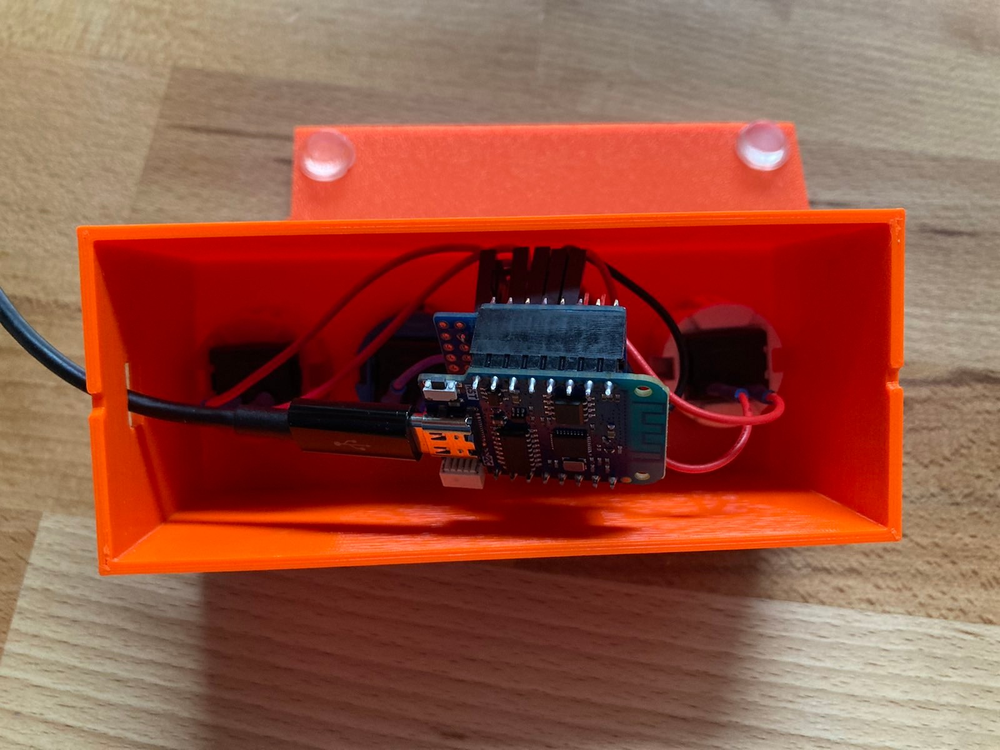
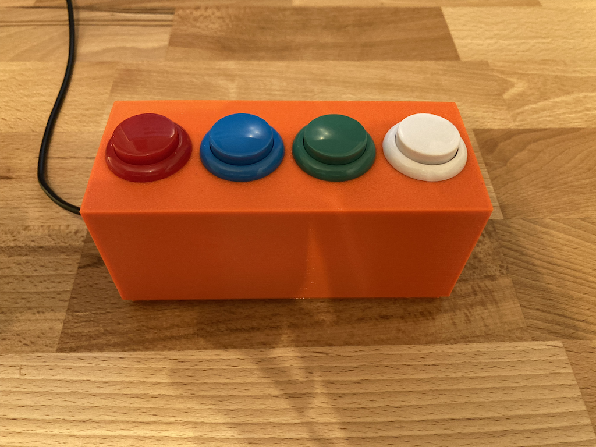
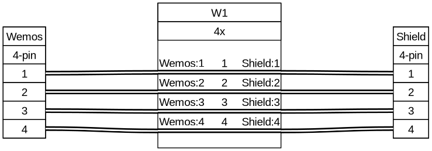
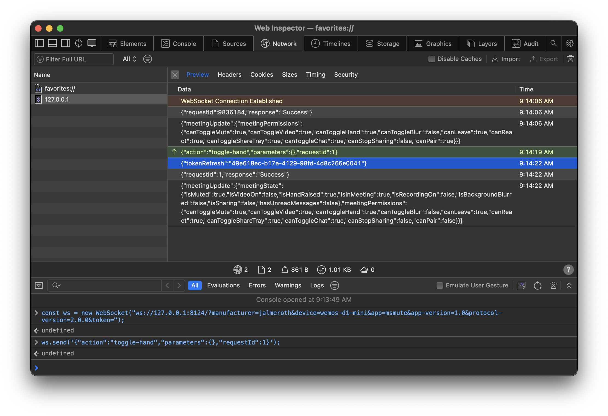
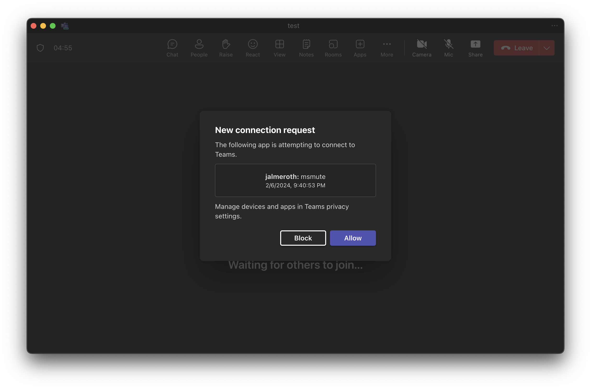

# MS Mute

A macro pad to control Microsoft Teams (via WebSocket) while you are on-call.




## Bill of material

- Microcontroller (e.g. [Wemos D1 mini](https://www.wemos.cc/en/latest/d1/d1_mini.html))
  - Wemos D1 mini [ProtoBoard Shield](https://www.wemos.cc/en/latest/d1_mini_shield/protoboard.html)
- 4x [Arcade Buttons](https://www.amazon.de/dp/B075DCB7LT)
- Various Jumper Wires & Resistors (10k/1k)

## Build a MS Mute device

### Assembly

> [!WARNING]
> This is still under development



### Flashing MicroPython

For more information on flashing MicroPython to the microcontroller take a look here: <https://www.wemos.cc/en/latest/tutorials/d1/get_started_with_micropython_d1.html>

### Buttons

| pin | color | action       | description          |
| --- | ----- | ------------ | -------------------- |
| 14  | white | toggle-hand  | Raise or lower hand  |
| 12  | green | toggle-mute  | Toggle mute on/off   |
| 13  | blue  | toggle-video | Toggle camera on/off |
| 15  | red   | leave-call   | Leave the meeting    |

### Copy project files

You can use `adafruit-ampy` to copy the files to your board. Checkout the tutorial here: <https://learn.adafruit.com/micropython-basics-load-files-and-run-code/overview>.

```sh
# switch working directory to `src`
cd src
# copy all files to the microcontroller
ampy --port /dev/ttyUSB1 put ./ /
```

#### Configuration

```json filename=config.json
{
  […]
  "WS_TOKEN": "49e618ec-b17e-4129-98fd-4d8c266e0041",
  "WS_URI": "ws://192.168.0.100:8123"
}
```

The value for `WS_TOKEN` is generated by **Microsoft Teams** once the third-party device pairing was successful. See [General Setup](#general-setup-macos) for more information.

`WS_URI` consists of the prefix `ws://` for a WebSocket connection, your computers IP address (e.g `192.168.0.101`) and the exposed port `8123`. See [Exposing the port externally](#exposing-the-port-externally) for more information.

## General Setup (macOS)

### Enable Third-party app API

In **Microsoft Teams** go to Settings > Privacy > Third-party app API > check **enable**.
This will start the WebSocket-Server on port `8124`.

You can validate this by running `lsof` in **Terminal.app**:

```sh
# check if Teams opened the port on localhost
lsof | grep 8124
```

The output should show a line with something like `TCP localhost:8124 (LISTEN)`.

For more information refer to [Microsofts documentation](https://support.microsoft.com/en-us/office/connect-to-third-party-devices-in-microsoft-teams-aabca9f2-47bb-407f-9f9b-81a104a883d6).

### Aquiring a refresh token

In the **Developer Console** of your browser switch to the **Network** tab and make sure can see the **Console** below:



Lets connect to the Teams WebSocket-Server:

```js
const ws = new WebSocket(
  "ws://127.0.0.1:8124/?manufacturer=jalmeroth&device=wemos-d1-mini&app=msmute&app-version=1.0&protocol-version=2.0.0&token=",
);
```

Now join a Teams meeting and issue the following command in **Developer Console**:

```js
ws.send('{"action":"toggle-hand","parameters":{},"requestId":1}');
```



You will see a window to **Allow** or **Block** a new connection request.
Tapping **Allow** means the third-party device will pair and can interact with Teams; it will be added to the **Allowed apps and devices** list.

Pairing the device will issue a `tokenRefresh` as seen in the screenshot above.

The `tokenRefresh` value must be copied as `WS_TOKEN` in your `config.json`.

### Exposing the port externally

Since the WebSocket-Server port is bound to `localhost` we need to expose it externally. We can use `socat` for this:

```sh
# Install `socat` via `brew` first
brew install socat
# Export local-bound port (8124) on different port (e.g. 8123)
socat -4 TCP-Listen:8123,reuseaddr,fork TCP:localhost:8124
```

## CAD

The 3D-files for the enclosure can be found in [cad](./cad/)

## Further reading

- <https://techcommunity.microsoft.com/t5/microsoft-teams-blog/delivering-new-webinar-experiences-with-microsoft-teams/ba-p/3725145>
- <https://techcommunity.microsoft.com/t5/healthcare-and-life-sciences/update-5-using-the-native-elgato-stream-deck-integration-with/ba-p/3732044>
- <https://techcommunity.microsoft.com/t5/healthcare-and-life-sciences/elgato-stream-deck-now-working-in-the-new-teams-hls-show-me-how/ba-p/3977684>
